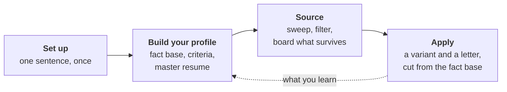
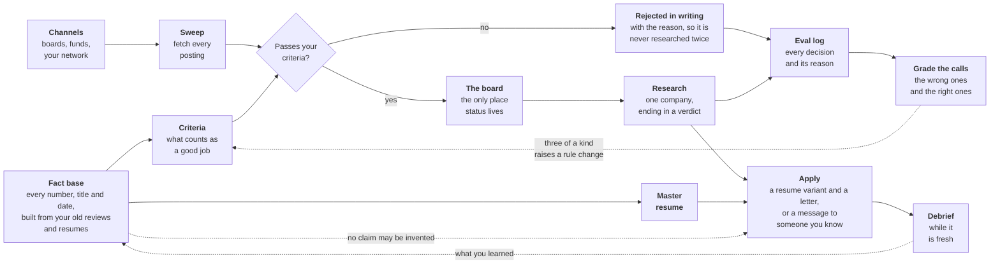

# Harpoon

A job search run as a repository, with Claude Code as the copilot.

You talk to it in plain language. It keeps one board, one fact base holding
everything true about your career, and a set of rules it has to follow. The
point is not to fire off applications faster. It is that nothing you send out
contradicts the record, and no company gets researched twice.



Four phases, and you say a sentence to start each one.

## Start

```
gh repo create my-harpoon --template lukearmistead/harpoon --private --clone
cd my-harpoon && claude
```

No `gh`? Click **Use this template** on GitHub, choose **private**, clone it,
and open the folder in Claude Code. Work in your own copy, never in a clone of
the template: your instance fills with your employment history.

Then say:

> **run setup**

Claude checks the repo is private and yours, installs the render toolchain if
it is missing, points git at the hooks, and writes the files the template
ships empty because they would otherwise carry somebody else's history. It
reports what it did and says what to do next. You do not have to read a config
file to start.

## The first hour

Five sentences, in this order. Claude runs each one end to end and interviews
you when it needs something only you know.

| Say this | What you get |
|---|---|
| "Here are my reviews and old resumes" (drop them in `profile/documents/` first) | It reads them, asks about the holes, and writes your fact base |
| "Let's work out my criteria" | `profile/criteria.md`, what counts as a good job for you |
| "Write my resume" | A master resume where every claim traces to the fact base |
| "Here's my LinkedIn export" (unzip it into `profile/network/export/`) | The warm paths, so outreach starts from someone you already know |
| "Find me some companies" | Boards and your network swept, filtered against your criteria, put on the board |

Experience comes first because the criteria and the resume are both cut from
it, so you tell each story once. Lost your place? Ask "what should I do next?"

## Then, day to day

| Say this | What happens |
|---|---|
| "Add Acme to the board" | Hard-line checks, then full research into `apply/<name>/company.md`, ending in a verdict |
| "Apply to Acme" | Re-validates the posting, cuts a resume variant and a letter, renders both to PDF |
| "I applied to Acme" | The board updates that turn, unasked |
| "Here are my notes from a call" | Filed in `profile/meetings/`, then reconciled against the board and the company file |
| "That number is wrong, it was 40" | Checked once against the record, then your answer becomes the source of truth |
| "Is this role on thesis?" | Judged against your criteria, and you get talked out of it if it is not |

Two behaviors worth knowing. It does not commit without being asked. And it is
instructed to push back when the record disagrees with you, not only when it
disagrees with itself.

## How it stays honest

**One board.** `board.md` is the only place stage and next action live, and the
only todo list. If it is stale, the repo is lying.

**One fact base.** `profile/experience.md` holds every number, title, date and
scope claim. Nothing reaches a resume or a letter unless it is in there. This
is the guardrail against the failure mode that matters most: an AI that will
happily invent a plausible metric under time pressure. Beside it sit
`profile/positioning.md`, which version of a claim you say out loud, and
`profile/voice.md`, how you sound.

**Rules with instruments behind them.** `AGENTS.md` is the rulebook, written to
a standard any agent can read, and `CLAUDE.md` is a symlink to it. It is read
at the start of every session and it names the procedures in `skills/`, which
is how a plain sentence reaches the right one. Your own standing rules go in
`profile/criteria.md` and win when the two disagree. `scripts/check-all.sh`
runs on every commit, so the rules a machine can check are checked.



The three dotted lines are what makes this different from a spreadsheet.
Nothing reaches an application that is not already in the fact base. What you
learn in a conversation goes back into it. Every decision the search makes is
logged with its reason and graded later, so a rule that keeps being wrong gets
changed rather than argued about again. Three of a kind raises the change, and
you decide whether to make it.

## What is where

```
board.md          the board and the only todo list
profile/          yours: criteria, fact base, resume, voice, interviews,
                  meeting notes, raw documents, LinkedIn export
source/           where jobs come from, and the words the sweep filters on
apply/            one directory per company that advances
learn/            one directory per sweep run, where calls get graded
skills/           the nine procedures the copilot follows
tools/            the code, with tests/ beside it
scripts/          the checks, run by .githooks/pre-commit
```

Resumes are markdown because the master gets cut into a variant per company,
and seeing what changed has to be one glance at a diff. Typst does the layout,
and rendering to a PDF an applicant tracking system will accept is one step
inside the write-application skill.

`AGENTS.md` has the full map and the rules behind it. You should not need to
open either one to use this. Ask Claude instead.

## Contributing

Your instance is private and stays that way. What flows back is template
material: a fix to a skill, a new ATS quirk, a schema improvement. The seam is
already drawn, so when the copilot flags a lesson as template material, let it
open a PR here. Personal rules, channels and criteria never belong upstream.
