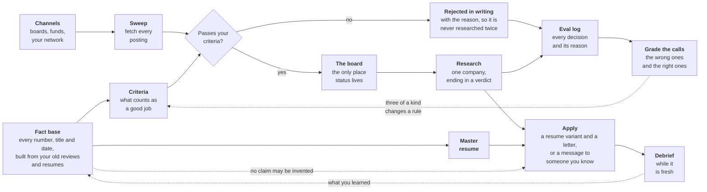

# Harpoon

A job search run as a repository, with Claude Code as the copilot.

The point is not to generate applications faster. It is to keep one honest
record of what is true, what has been decided, and why, so that nothing
written in a cover letter contradicts the record and no company gets
researched twice.

## The idea, in three parts

**One board.** `pipeline.md` is the only place stage and next action live. If
it is stale, the repo is lying. There is no separate todo list. Every decision
on it is a dated, append-only line, which is also what makes the search
reviewable later: the record shows what was predicted and what happened.

**One fact base.** `me/experience.md` holds every number, title, date and
scope claim. Nothing may go into a resume, cover letter or outreach unless it
is in there. This is the guardrail against the failure mode that matters most:
an AI that will happily invent a plausible metric under time pressure.

**Rules the copilot has to follow.** `CLAUDE.md` holds the engine's
machinery; `me/criteria.md` holds what you are looking for and how you want
to be worked with, and wins when they disagree. Both are read before
anything else happens.

Everything else is derived from those.

## Getting started

This is a template. Do not clone it and work in the clone: your instance
fills with your employment history and application record, and it needs a
private home of its own.

1. Click **Use this template** on GitHub and create a **private** repo, or run
   `gh repo create my-harpoon --template <this-repo> --private --clone`.
2. Install the render toolchain: `brew install pandoc typst uv` and
   `brew install --cask font-inter`.
3. Open the repo in Claude Code and say "run setup". It verifies the instance:
   private remote, git identity, toolchain.
4. Drop whatever you have into `me/experience/`: performance reviews,
   self-assessments, old resumes, project docs. Say "build my fact base".
   The gather-experience skill reads everything, interviews you to fill the
   holes, and writes the fact base. It runs first because the criteria and
   the resume are both built from it, so you tell each story once.
5. Say "let's work out my criteria". The write-criteria skill drafts what
   the fact base already answers and interviews you for the rest, then
   writes `me/criteria.md`.
6. Say "write my resume". The write-resume skill cuts the master resume
   from the fact base, judged against your criteria.
7. Export your LinkedIn data into `me/network/export/` (see
   `me/network/README.md`).
8. Say "find me some companies". The sweep seeds your channel catalog on its
   first run, then sources, filters against your criteria, and puts survivors
   and rejections on the board.

Your work is backed up by pushing: everything original is tracked, and the
only ignored files are rebuildable renders and the re-exportable LinkedIn
export. If a single file ever gets too big for GitHub, `git lfs track` it;
nothing here needs that on day one.

## The loop



Two bands, both reading left to right. Along the top, postings arrive and get
measured against your criteria: most are rejected, in writing, which is what
stops the same company being researched twice next month. Along the bottom sits
the record of you, and everything sent out is cut from it.

The three dotted lines are the part that makes this different from a
spreadsheet. Nothing reaches an application that is not already in the fact
base. What you learn in a conversation goes back into it. And every decision the
search makes is logged with its reason and graded later, so a rule that keeps
being wrong gets changed rather than argued about again.

1. **Source.** The sweep-jobs skill fans agents across your channel catalog and
   your network export, then filters what comes back against your criteria.
2. **Board it.** Survivors and rejections both go on `pipeline.md`. Writing
   down why something was rejected is what stops it being re-researched next
   month.
3. **Research what advances.** The research-company skill goes deep on one
   company and writes `applications/<name>/company.md`, ending in a verdict.
4. **Apply, or talk to someone.** The write-application skill re-validates the seat, cuts
   a resume variant and a cover letter from the fact base, and renders the
   PDFs an applicant tracking system will accept.
5. **Debrief.** Notes from conversations go in `me/meetings/`. After an
   interview, write the debrief while it is fresh.
6. **Feed it back.** A lesson worth keeping becomes a criteria change or a
   channel note in the same turn it is learned, and a call that proves wrong
   gets the row that made it adjudicated under `evals/`.

## Using it day to day

Talk to the copilot in plain language. The rules in `CLAUDE.md` do the
routing.

| Say this | What happens |
|---|---|
| "Here are my old performance reviews" | Reads them, interviews you about what is missing, writes the session down, then updates the fact base and the resume |
| "That number is wrong, it was 40" | Checks it once against the record, then takes your answer as the new source of truth |
| "Find me some companies" | Runs the sweep, returns candidates with reasons, updates the board |
| "Add Acme to the board" | Hard-line checks first, then full research into `applications/<slug>/company.md` |
| "I applied to Acme" | `pipeline.md` updates in the same turn, unasked |
| "Here are my notes from a call" | Note lands in `me/meetings/`, then gets reconciled against the board and the company file |
| "Draft outreach to Acme" | Reads the voice rules and the fact base first, and asks rather than inventing a missing number |
| "Is this role on thesis?" | Evaluated against `me/criteria.md`, and you get talked out of it if it is not |
| "Apply to Acme" | Re-validates the posting, drafts a variant and a letter, renders both to PDF |

Two behaviors worth knowing about. The copilot does not commit without being
asked. And it is instructed to push back when the record disagrees with you,
not only when it disagrees with itself.

## What is where

```
pipeline.md         the board. Stage, next action, overrides, rejections
evals/              one directory per sweep run: run.json, sweep.csv and
                    judgment.csv. Each row is a prediction, and its empty
                    adjudication columns are where a call gets graded in the
                    machine learning sense
applications/       one directory per company. company.md holds the research
                    and its dated log, then the resume variant, the cover
                    letter, form-fill.md, takehomes, prep docs, post-mortems,
                    and the rendered PDFs
me/criteria.md      what counts as a good job. Under 100 lines on purpose
me/experience.md    the fact base. Every number lives here or nowhere
me/resume.md        the master resume
me/channels.md      where the sweep looks, and what it has learned
me/interviews/      the interview sessions the fact base cites as authority
me/meetings/        notes from conversations
me/experience/      raw source material: reviews, analyses, documents
me/network/         LinkedIn export under export/, derived rosters beside it
.claude/skills/     the nine procedures: setup, gather-experience,
                    write-criteria, write-resume, sweep-jobs,
                    research-company, write-application, update-board,
                    review-evals. Skill-owned scripts and reference files
                    sit inside their skill directory
harpoon/            engine code with tests/ beside it
CLAUDE.md           the rules the copilot follows
scripts/check-citations.sh  fails on a cited path that is missing and not gitignored
```

## Why markdown, when the resume ends up a PDF

Because the master resume gets cut into a variant per company, and reviewing
what changed between two variants has to be one glance at a diff. That only
works if the source is prose. So the seam is markdown for content, Typst for
layout, in `resume.typ` inside the write-application skill, and
`.claude/skills/write-application/render-application.sh` beside it turns a
draft into the PDF an applicant tracking system will accept. When markdown cannot express something, raw
Typst passes straight through a fenced block.

## The failure modes this is built against

Worth stating, because every convention here exists because one of these
happened to someone.

- **Invented numbers.** Hence the fact base, verbatim quoting, and attribution
  on every claim.
- **Volume creep.** Cheap tailoring turns into more applications with less
  thought behind each. The copilot is instructed to say so when the count
  climbs and the depth falls.
- **A stale board.** A conversation that changes the read on a company has to
  move the stage, the verdict and the next action, or the meeting may as well
  not have happened.
- **Rules that bend silently.** Overrides are allowed and get written down and
  counted. A rule that bends three times is the wrong rule.
- **Trusting a summary over a source.** Job aggregators disagree with the
  postings they aggregate. The skills say to read the posting.

## Contributing

Your instance is private and stays that way. What flows back is engine
material: a fix to a skill, a new ATS quirk, a schema improvement. The seam is
already drawn, engine files carry nothing personal, so when the copilot flags
a lesson as engine material, let it open a PR here. Personal rules, channels,
and criteria never belong upstream.
